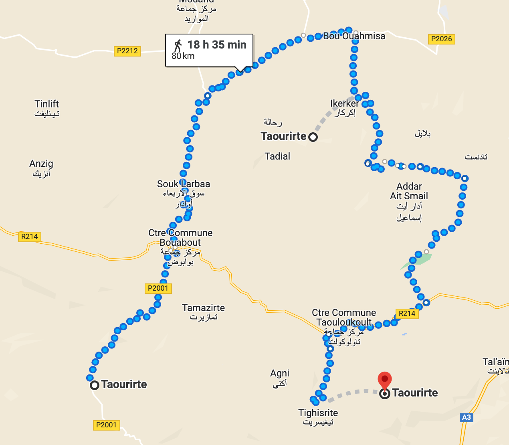

# morocco-hackathon-gps

Assign GPS locations to 7000 villages in Morocco

This work was done in the context of [the Morocco Solidarity Hackathon](https://morocco-solidarity-hackathon.io/).

## How to use

1. Install requirements

   ```bash
   pip install -r requirements.txt
   ```

2. Get a Google Maps API key
   1. Store it in the untracked file `./google_maps_api.key`
   2. Or as an environment variable `GOOGLE_MAPS_API_KEY=<your key>`

3. Run the script

   ```bash
   $ python douar_to_coords.py
   Writing to ./listes-localités-gps.xlsx
   ```

4. The scripts will write a new file with 2 new columns: `"Google Maps query"` and `"gps"`.

## Mismatches

We tried our best to disentangle Google Maps results. Whenever possible, we try to select the best match in the list of candidates returned by the API.

In some cases however, the API does not return enough information for us to be able to reliably select a single GPS location. This happens ~4% of cases:

```txt
Number of addresses with 1 matches: 6676
Number of addresses with 2 matches: 283
Number of addresses with 3 matches: 20
Number of addresses with 4 matches: 1
```

Here is such an example, with the API returning 3 results: the 3 GPS locations are too far from each other to be considered as the same place. We therefore keep the 3 GPS coordinates in the `"gps"` column.



```txt
Direct distance 1<>0 : 20.32km
Direct distance 2<>0 : 17.90km
Direct distance 2<>1 : 16.35km
```
